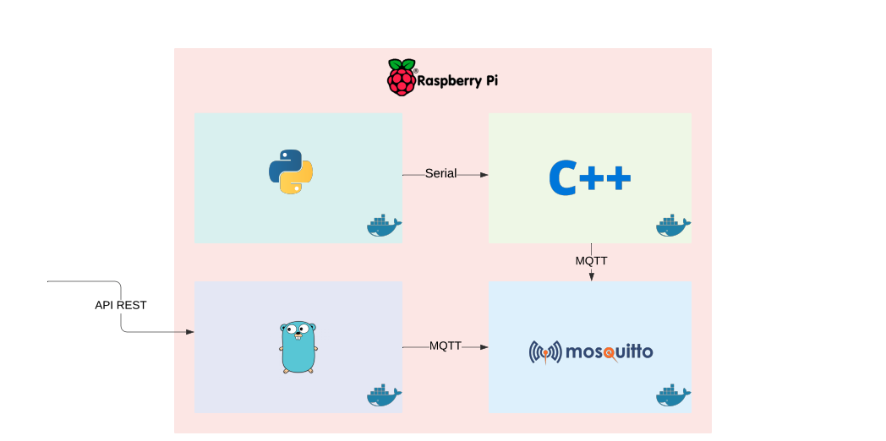

# Raspberry MQTT Project




The project is separeted in four parts: 

- An **API REST** in Golang to set the led state and read the sensor values;
- An Eclipse Mosquitto **MQTT Broker**;
- A C++ binary to read the sensor values and set the led state;
- A Python script to set broker's `hostname`, `topics` and `sensor refresh rate`;

All of them are inside a Docker, you can run with `docker-compose`.

## Installing Dependencies

You need both [Docker](https://www.docker.com/) and [docker-compose](https://docs.docker.com/compose/install/) installed on your Raspberry. If you are not using Docker, you need [Go](https://golang.org/doc/install), [GCC](https://gcc.gnu.org/), [Python3](https://www.python.org/download/releases/3.0/) and [Mosquitto MQTT Broker](https://mosquitto.org/).

## Running

You can run the `docker-compose`, with the following command:

```shell
$ docker-compose up
```

It will start the `REST API`

## Raspberry Pi

Build the binary:

```shell
$ gcc main.c -o mqtt_exemplo -lpaho-mqtt3c -I/usr/local/include -L/usr/local/lib -lwiringPi -pthread -lpthread -Wall
```

Run the binary:

```shell
$ ./rasp
```

## Control

Install the third party dependencies:

```shell
$ go mod download
```

To run it, do the following:

```shell
$ go run control.go
```

### Docker

To run the `Dockerfile`, build the image:

```shell
$ docker build . -t control
```

To run it set a environment variable `PORT` with the port you wanna use and, do the following:

```shell
$ export PORT=8000

$ docker run -p $PORT:$PORT -e PORT=$PORT control
```

### API Documentation

Endpoints:

| Endpoint      | Request | Description      | Data type  |
| ------------- | ------- | ---------------- | ---------- |
| `/led/{state}`| GET     | Set led state    | bool (1/0) |
| `/sensor`     | GET     | Get sensor value | -          |

Examples:

Turn led on:

```shell
$ curl http://localhost/led/1
```

Turn led off:

```shell
$ curl http://localhost/led/0
```

Get actual sensor value:

```shell
$ curl http://localhost/sensor
```

## SW-Configuration

To run it, do the following:

```shell
$ python3 sw_config.py
```

### Docker

To run the `Dockerfile`, build the image:

```shell
$ docker build . -t sw
```

To run it, do the following:

```shell
$ docker run -ti sw
```

## Eclipse Mosquitto

To run the Broker image, do the following:

```shell
$ docker run -it -p 1883:1883 -p 9001:9001  eclipse-mosquitto
```

## Authors

Made by:

[Leonardo Augusto](https://github.com/leozz37)

[Leonardo Andretta](https://github.com/LeoAndretta)

**Under construction...**
